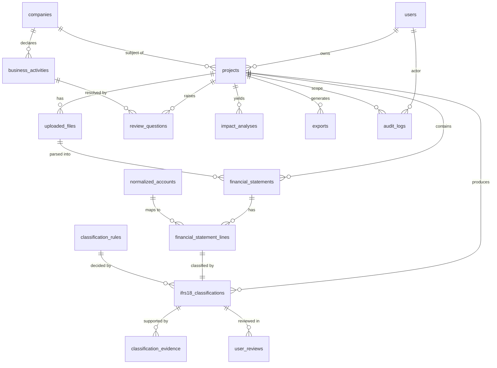

# Task 3 — Entity Relationship Diagram

> Status: **implemented 2026-09-19** (Phase 2). Models live in
> `backend/app/models/`, the migration in
> `backend/alembic/versions/*_initial_schema.py`. 17 tables, 65 CHECK
> constraints. `alembic check` runs in CI, so the schema cannot drift from
> the models without failing the build.

## 1. Overview diagram



## 2. Table definitions

Conventions: primary keys are `uuid` (`gen_random_uuid()`); every table carries
`created_at timestamptz not null default now()`; mutable tables also carry
`updated_at`. All monetary columns are `numeric(38,6)`. Enum-like columns are
stored as `text` with a `CHECK` constraint rather than a PostgreSQL `ENUM` type —
see §4.

### `users`
| column | type | notes |
|---|---|---|
| id | uuid PK | |
| email | citext UNIQUE NOT NULL | |
| display_name | text | |
| role | text NOT NULL | `OWNER` / `PREPARER` / `REVIEWER` / `VIEWER` |
| password_hash | text | null when SSO-only |
| deleted_at | timestamptz | soft delete |

### `companies`
Separated from `projects` because main business activities (§10) are a property
of the *entity*, reusable across reporting periods.

| column | type | notes |
|---|---|---|
| id | uuid PK | |
| name | text NOT NULL | |
| identifier | text | 사업자등록번호 / DART corp_code / LEI |
| identifier_scheme | text | `KR_BRN` / `DART` / `LEI` |
| jurisdiction | text NOT NULL DEFAULT 'KR' | |
| industry_code | text | **informational only — never drives classification (§10)** |

### `projects`
The unit of analysis: one entity, one reporting period, one restructuring run.

| column | type | notes |
|---|---|---|
| id | uuid PK | |
| owner_user_id | uuid FK → users | |
| company_id | uuid FK → companies | |
| name | text NOT NULL | |
| fiscal_year | int NOT NULL | |
| period_start / period_end | date NOT NULL | |
| basis | text NOT NULL | `CONSOLIDATED` / `SEPARATE` |
| presentation_currency | char(3) NOT NULL | ISO 4217 |
| presentation_scale | int NOT NULL DEFAULT 0 | power of 10 the source is stated in (6 = 백만원) |
| status | text NOT NULL | see state machine §3 |
| reconciliation_status | text NOT NULL | `NOT_RUN` / `PASSED` / `FAILED` |
| rule_set_version | text | pinned at classify time for reproducibility |
| config_snapshot | jsonb | thresholds/tolerances in force for this run |
| finalized_at | timestamptz | |
| deleted_at | timestamptz | |

`config_snapshot` matters: if a confidence threshold (§11) is later changed
globally, an already-finalized project must still explain itself under the rules
that actually applied to it.

### `uploaded_files`
| column | type | notes |
|---|---|---|
| id | uuid PK | |
| project_id | uuid FK → projects | |
| original_filename | text NOT NULL | stored, never used as a filesystem path |
| storage_key | text NOT NULL | object-store key, opaque |
| mime_type | text NOT NULL | sniffed, not trusted from the client |
| size_bytes | bigint NOT NULL | |
| sha256 | char(64) NOT NULL | dedupe + tamper evidence |
| scan_status | text NOT NULL | `PENDING` / `CLEAN` / `INFECTED` / `SKIPPED` |
| parse_status | text NOT NULL | `PENDING` / `PARSED` / `FAILED` |
| purge_after | timestamptz | retention policy (§32) |
| uploaded_by | uuid FK → users | |

### `financial_statements`
One per statement per period found in a file.

| column | type | notes |
|---|---|---|
| id | uuid PK | |
| project_id | uuid FK → projects | |
| uploaded_file_id | uuid FK → uploaded_files | |
| statement_type | text NOT NULL | `INCOME_STATEMENT`, `OCI`, `BALANCE_SHEET`, … |
| period_start / period_end | date | |
| is_comparative | boolean NOT NULL DEFAULT false | prior-period column |
| currency | char(3) NOT NULL | |
| scale | int NOT NULL DEFAULT 0 | |
| source_locator | jsonb | e.g. `{"sheet":"Income Statement","header_row":4}` |

MVP restructures `INCOME_STATEMENT` only; the other types are accepted so that
extraction validation (§17) can check balance-sheet identities.

### `financial_statement_lines`
The extracted facts. Immutable once written — corrections create a new
extraction run rather than mutating history.

| column | type | notes |
|---|---|---|
| id | uuid PK | |
| statement_id | uuid FK → financial_statements | |
| ordinal | int NOT NULL | presentation order in the source |
| depth | int NOT NULL DEFAULT 0 | indentation level |
| raw_label | text NOT NULL | exactly as printed, e.g. `이자수익` |
| raw_value | text NOT NULL | exactly as printed, e.g. `(2,000)` |
| amount | numeric(38,6) NOT NULL | **signed P&L effect** (arch §5) |
| sign_normalization | text NOT NULL | how raw_value became amount; auditable |
| is_subtotal | boolean NOT NULL DEFAULT false | **excluded from all summation** |
| subtotal_kind | text | `GROSS_PROFIT` / `REPORTED_OPERATING_PROFIT` / `PBT` / … |
| parent_line_id | uuid FK → financial_statement_lines | set on a component produced by decomposing an aggregate (Q5) |
| decomposition_status | text NOT NULL DEFAULT `NOT_REQUIRED` | `NOT_REQUIRED` / `REQUIRED` / `DECOMPOSED` / `ACCEPTED_AGGREGATE` |
| normalized_account_id | uuid FK → normalized_accounts | nullable until Step 3 |
| normalization_method | text | `EXACT` / `SYNONYM` / `FUZZY` / `AI` / `MANUAL` |
| normalization_score | numeric(5,4) | |
| current_category | text | the item's presentation bucket *as reported* |
| source_locator | jsonb NOT NULL | **provenance (§18)** — see below |
| note_references | text[] | e.g. `{"주석 12"}` |

`source_locator` for XLSX (§18):
```json
{"source_file":"fs.xlsx","sheet":"Income Statement","row":17,"column":"D","cell":"D17"}
```
for PDF:
```json
{"source_file":"fs.pdf","page":42,"table_index":1,"row":17,"bbox":[72.0,431.2,523.4,444.0]}
```

Constraint: `is_subtotal = true` ⇒ `normalized_account_id IS NULL` and no
classification row may reference the line.

**Decomposition (Q5, resolved 2026-09-19).** Korean statements frequently present
only an aggregate caption (영업외수익, 금융수익). Because IFRS 18 makes operating
the residual category, and because B65 sends foreign exchange differences to the
category of the item that produced them, an undecomposed caption can conceal a
real operating-profit effect.

- A caption the engine cannot classify as a whole is marked
  `decomposition_status = REQUIRED`.
- The user enters its components from the notes. Each becomes a **child line**
  with `parent_line_id` set and its own `source_locator` pointing at the note,
  and the parent moves to `DECOMPOSED`.
- **A parent with `decomposition_status = DECOMPOSED` is excluded from all
  summation**, exactly like a subtotal, so the components are counted once.
  A `CHECK` enforces that a `DECOMPOSED` parent carries no classification row.
- A user who cannot decompose may set `ACCEPTED_AGGREGATE`. The caption is then
  classified as a single line, the limitation is written to the audit trail, and
  the impact response carries a warning that the operating-profit effect may be
  understated. This is a visible, recorded limitation — never a silent one.
- Σ(children) must equal the parent's `amount`; a mismatch is an extraction-level
  reconciliation failure, not a rounding allowance.

### `normalized_accounts`
The canonical account dictionary (spec §4 Step 3). Seeded, not user-specific.

| column | type | notes |
|---|---|---|
| id | uuid PK | |
| code | text UNIQUE NOT NULL | `REVENUE`, `INTEREST_INCOME`, `SHARE_OF_PROFIT_OF_ASSOCIATES`, … |
| label_ko / label_en | text NOT NULL | |
| statement_section | text NOT NULL | `PL` / `OCI` / `BS` |
| default_nature | text | `INCOME` / `EXPENSE` — sanity check on sign |
| parent_code | text FK → normalized_accounts.code | hierarchy |
| is_active | boolean NOT NULL DEFAULT true | |

### `account_synonyms`
Kept separate so the dictionary can grow without schema change.

| column | type | notes |
|---|---|---|
| id | uuid PK | |
| normalized_account_id | uuid FK → normalized_accounts | |
| synonym | text NOT NULL | `매출액`, `매출`, `Revenue`, `수익(매출액)` |
| locale | text NOT NULL | `ko` / `en` |
| match_type | text NOT NULL | `EXACT` / `NORMALIZED` / `REGEX` |
| UNIQUE (synonym, locale) | | |

"Normalized" match = whitespace stripped, full-width→half-width, parenthetical
suffixes removed, case-folded.

### `classification_rules`
Rules are **data, not code** (spec §25) so that each carries its authoritative
citation and effective date.

| column | type | notes |
|---|---|---|
| id | uuid PK | |
| rule_id | text UNIQUE NOT NULL | e.g. `IFRS18-INVESTING-001` |
| version | text NOT NULL | |
| priority | int NOT NULL | lower = evaluated first |
| description | text NOT NULL | |
| condition | jsonb NOT NULL | declarative predicate, see `04-classification-engine.md` |
| outcome_category | text NOT NULL | |
| outcome_subcategory | text | |
| requires_activity_fact | text | activity type that must be confirmed first → `NEEDS_FACT` |
| source_type | text NOT NULL | `IFRS_STANDARD` / `TAXONOMY` / `IASB_EDUCATIONAL` / `BIG4` / `OTHER` |
| source_reference | text NOT NULL | e.g. `IFRS 18 paragraph 49` |
| source_url | text | |
| effective_date | date NOT NULL | |
| superseded_by | uuid FK → classification_rules | |
| confidence_ceiling | numeric(5,4) | caps confidence for weaker sources |
| is_active | boolean NOT NULL DEFAULT true | |

`source_type` is ordered exactly as spec §25 ranks authority. A rule whose only
support is a secondary source cannot claim the same confidence as one citing the
standard; `confidence_ceiling` encodes that.

### `ifrs18_classifications`
One row per classifiable line. Carries every field required by spec §8.

| column | type | notes |
|---|---|---|
| id | uuid PK | |
| project_id | uuid FK → projects | |
| line_id | uuid FK → financial_statement_lines UNIQUE | one live classification per line |
| original_account | text NOT NULL | denormalized snapshot (§8) |
| normalized_account_code | text | snapshot, not FK — survives dictionary edits |
| amount | numeric(38,6) NOT NULL | snapshot |
| current_category | text | |
| proposed_ifrs18_category | text | |
| proposed_ifrs18_subcategory | text | |
| final_ifrs18_category | text | null until resolved |
| final_ifrs18_subcategory | text | |
| classification_method | text NOT NULL | `RULE` / `AI` / `RESIDUAL_DEFAULT` / `USER` / `UNRESOLVED` |
| rule_id | text | FK-by-value → classification_rules.rule_id |
| rule_set_version | text | |
| ai_model | text | |
| ai_confidence | numeric(5,4) | |
| ai_reasoning | text | |
| ai_raw_response | jsonb | exact model output, for audit |
| confidence_band | text | `HIGH` / `MEDIUM` / `LOW`, derived from project config |
| requires_human_review | boolean NOT NULL | |
| user_override | boolean NOT NULL DEFAULT false | |
| override_reason | text | |
| reviewed_at | timestamptz | |
| reviewer_user_id | uuid FK → users | |
| impact_on_operating_profit | numeric(38,6) | computed; see §5 below |

The `original_account` / `amount` / `normalized_account_code` snapshots are
intentional denormalization: an audit record must remain readable even if the
account dictionary is later edited.

### `classification_evidence`
| column | type | notes |
|---|---|---|
| id | uuid PK | |
| classification_id | uuid FK → ifrs18_classifications | |
| evidence_type | text NOT NULL | `FINANCIAL_STATEMENT` / `NOTE` / `RULE_SOURCE` / `USER_STATEMENT` / `BUSINESS_ACTIVITY` |
| reference | text NOT NULL | e.g. `Note 12` |
| excerpt | text | bounded length; redacted from logs |
| locator | jsonb | page/cell pointer back to the source |
| produced_by | text NOT NULL | `RULE` / `AI` / `USER` |

### `business_activities`
Spec §10. Named `business_activities` per §16; scoped to a company.

| column | type | notes |
|---|---|---|
| id | uuid PK | |
| company_id | uuid FK → companies | |
| project_id | uuid FK → projects | nullable — confirmation can be project-scoped |
| activity_type | text NOT NULL | `INVESTING_IN_ASSETS`, `PROVIDING_FINANCING_TO_CUSTOMERS`, `FINANCIAL_SERVICES`, `INVESTMENT`, `LENDING`, `REAL_ESTATE`, `OTHER` |
| is_main_business_activity | boolean | **null = unknown.** Never defaulted. |
| description | text | |
| source | text NOT NULL | `USER` / `AI_SUGGESTED` / `DOCUMENT` |
| confirmed_by_user | boolean NOT NULL DEFAULT false | |
| confirmed_by | uuid FK → users | |
| confirmed_at | timestamptz | |

Three-valued `is_main_business_activity` is deliberate. `NULL` (unknown) must be
distinguishable from `false` (user said no), because only `NULL` should block a
`NEEDS_FACT` rule and raise a question.

### `review_questions`
Makes Step 5 of the flow a first-class, auditable object rather than transient UI
state.

| column | type | notes |
|---|---|---|
| id | uuid PK | |
| project_id | uuid FK → projects | |
| scope | text NOT NULL | `COMPANY` / `LINE` — see below (Q4) |
| line_id | uuid FK → financial_statement_lines | required when `scope = LINE`, else null |
| question_key | text NOT NULL | stable key, e.g. `SMBA_INVESTING_IN_ASSETS`, `DERIVATIVE_RISK_MANAGED` |
| question_text_ko / _en | text NOT NULL | |
| raised_by_rule_id | text | which rule returned `NEEDS_FACT` |
| answer | text | `YES` / `NO` / `NOT_SURE`, or an enum value for a choice question |
| answered_by | uuid FK → users | |
| answered_at | timestamptz | |
| resulting_activity_id | uuid FK → business_activities | |
| blocks_finalization | boolean NOT NULL DEFAULT true | |

`NOT_SURE` is a real, persisted state (spec §5 offers it). It does not resolve
the rule; affected lines stay in review and finalization stays blocked, with the
reason shown.

**Question scope (Q4, resolved 2026-09-19).** Specified main business activities
are facts about the *entity*, so one answer settles every affected line
(`scope = COMPANY`). The risk a derivative manages, which IFRS 18 **B72** needs
in order to assign a category, is a fact about *that instrument* — two derivative
lines in one statement can manage different risks — so it is asked per line
(`scope = LINE`). `UNIQUE (project_id, question_key, line_id)` prevents asking
the same question twice.

A `LINE`-scoped derivative question offers the categories a risk can map to, plus
an explicit **"would require grossing up, or involve undue cost or effort"**
option that routes the line to `OPERATING` under `IFRS18-DERIV-002`. Either way
the resulting classification cites B72.

### `user_reviews`
Append-only record of each human decision (spec §8, §16).

| column | type | notes |
|---|---|---|
| id | uuid PK | |
| classification_id | uuid FK → ifrs18_classifications | |
| reviewer_user_id | uuid FK → users NOT NULL | |
| action | text NOT NULL | `ACCEPTED` / `OVERRIDDEN` / `DEFERRED` |
| previous_category | text | |
| new_category | text | |
| reason | text | |
| reviewed_at | timestamptz NOT NULL | |

### `impact_analyses`
A computed snapshot, stored so an exported report is reproducible byte-for-byte.

| column | type | notes |
|---|---|---|
| id | uuid PK | |
| project_id | uuid FK → projects | |
| computed_at | timestamptz NOT NULL | |
| rule_set_version / config_snapshot | text / jsonb | |
| reconciliation_status | text NOT NULL | |
| reconciliation_details | jsonb | each check, expected, actual, delta |
| kpis | jsonb NOT NULL | before/after/change/change_pct per KPI (§6) |
| waterfall | jsonb NOT NULL | ordered bridge steps (§5) |
| is_current | boolean NOT NULL DEFAULT true | superseded when recomputed |

KPIs and the waterfall are stored as `jsonb` rather than relational rows on
purpose: they are a *derived, versioned report artifact*, always read whole,
never queried field-by-field. Normalizing them would add joins and buy nothing.

### `exports`
| column | type | notes |
|---|---|---|
| id | uuid PK | |
| project_id | uuid FK → projects | |
| impact_analysis_id | uuid FK → impact_analyses | exactly what was exported |
| format | text NOT NULL | `XLSX` / `PDF` |
| storage_key | text NOT NULL | |
| status | text NOT NULL | `PENDING` / `READY` / `FAILED` |
| requested_by | uuid FK → users | |
| expires_at | timestamptz | |

### `audit_logs`
Append-only. No `UPDATE` or `DELETE` grant for the application role.

| column | type | notes |
|---|---|---|
| id | bigserial PK | |
| occurred_at | timestamptz NOT NULL DEFAULT now() | |
| actor_user_id | uuid FK → users | null for system actions |
| actor_type | text NOT NULL | `USER` / `SYSTEM` / `AI` |
| project_id | uuid FK → projects | |
| entity_type | text NOT NULL | |
| entity_id | uuid | |
| action | text NOT NULL | `CREATED` / `CLASSIFIED` / `OVERRIDDEN` / `FINALIZED` / `EXPORTED` / … |
| before | jsonb | |
| after | jsonb | |
| request_id | text | correlates with structured logs |

`before`/`after` exclude monetary detail where it is not needed, and the logging
pipeline redacts amounts from application logs (spec §32) — the audit table is
the one intentional, access-controlled place where those values live.

**Append-only enforcement (implemented).** A `BEFORE UPDATE OR DELETE` trigger
raises `restrict_violation` on any attempt to modify a row. A trigger was
chosen over role grants because the application commonly owns its tables in
development and a table owner bypasses `REVOKE`; a trigger holds regardless of
role and is directly testable (`test_audit_log_cannot_be_updated`).

## 3. Project state machine

```
DRAFT ──upload──> UPLOADED ──extract──> EXTRACTED ──classify──> CLASSIFIED
                                            │                        │
                                       extract fails            open questions
                                            ▼                     or reviews
                                     EXTRACTION_FAILED          ──> IN_REVIEW
                                                                      │
                                                        all resolved  │ finalize
                                                                      ▼
                                          RECONCILIATION_FAILED <── (validate) ──> FINALIZED
```

Rules:
- `finalize` is rejected while any `review_questions.blocks_finalization` is
  unanswered or answered `NOT_SURE`, or any classification has
  `requires_human_review = true` and `reviewed_at IS NULL`.
- `RECONCILIATION_FAILED` still exposes `/impact`, but every response carries
  `reconciliation_status: "FAILED"` and the client must render the degraded
  state (spec §19).
- Editing a classification on a `FINALIZED` project moves it back to
  `IN_REVIEW` and marks the existing `impact_analyses` row `is_current = false`.

## 4. Schema-level decisions worth flagging

1. **`text` + `CHECK` instead of PostgreSQL `ENUM`.** Spec §9 requires the
   classification taxonomy to be extensible. Altering a PG enum is awkward inside
   a transaction and painful to roll back; a `CHECK` constraint changes with a
   one-line migration. The authoritative enum list lives in Python
   (`app/domain/enums.py`) and the constraint is **generated** from it by
   `app.db.base.enum_check`, which sorts members so the emitted SQL is stable.
   Adding an enum member and running `alembic revision --autogenerate` produces
   the migration; CI's `alembic check` fails if someone forgets.

2. **Category and subcategory are two columns, not one.** Spec §9 asks for the
   five top-level categories with optional finer granularity. Storing
   `OPERATING` + `OPERATING_REVENUE` separately means every aggregation works on
   `category` alone and stays correct no matter how many subcategories are added
   later. A single `OPERATING_REVENUE` column would force every query to know the
   full subcategory list.

3. **Snapshot columns in `ifrs18_classifications`.** Deliberate denormalization
   for audit durability, as noted above.

4. **`impact_analyses` is a snapshot table, not a view.** An exported PDF must be
   reproducible. A view would silently change when a rule or dictionary entry is
   edited.

5. **One live classification per line (`UNIQUE(line_id)`), history in
   `user_reviews` + `audit_logs`.** The alternative — versioned classification
   rows — makes every read query need a "latest" filter, for no gain the audit
   tables do not already provide.

## 5. `impact_on_operating_profit` — definition

Stored per classification so the account-level impact table (§7) and the
waterfall (§5) are computed once, server-side, from one definition:

```
op_before(line) = amount if line was inside the reported operating subtotal else 0
op_after(line)  = amount if final_ifrs18_category == OPERATING else 0
impact_on_operating_profit(line) = op_after(line) - op_before(line)
```

Then, by construction:
```
Σ impact_on_operating_profit  ==  IFRS18_operating_profit - reported_operating_profit
```
That equality is asserted as the operating-bridge reconciliation check (arch §7),
which is what makes the waterfall guaranteed to add up rather than merely
plausible.


## 6. Implementation notes (Phase 2)

### Constraints that encode product rules, not just data shapes

Several `CHECK` constraints exist to make a *specification* rule unbreakable at
the storage layer, not merely to keep columns tidy:

| Constraint | Enforces |
|---|---|
| `ai_always_requires_review` | Spec §1 — an AI proposal is never final, whatever its confidence |
| `ai_cannot_self_confirm` | Spec §10 — only a human confirms a main business activity |
| `override_records_reviewer` | Spec §8 — every human decision names the human and the time |
| `rule_method_records_rule_id` | Spec §8 — a rule-derived decision must cite its rule |
| `finalized_requires_reconciliation` | Spec §19 — a project cannot be finalized while unreconciled |
| `subtotal_has_no_account` | A subtotal is a reconciliation target, never a classifiable fact |
| `subtotal_not_decomposable` | A subtotal cannot also be an aggregate awaiting decomposition |
| `decomposed_parent_is_not_a_child` | Prevents a chain of containers hiding amounts from every sum |
| `line_scope_requires_line` | Q4 — a B72 question must name the instrument it asks about |

Each has a test in `tests/test_schema_constraints.py` that asserts the database
actually refuses the bad state. A documented constraint that is not enforced is
worse than no constraint, so none is taken on trust.

### `is_summable`

`FinancialStatementLine.is_summable` is the single place that decides whether a
line contributes to a category total:

```python
not self.is_subtotal and self.decomposition_status != DecompositionStatus.DECOMPOSED
```

Both exclusions exist to prevent double counting: a subtotal already aggregates
lines below it, and a decomposed parent's amount is carried by its children.
An index on `(statement_id, is_subtotal, decomposition_status)` supports the
summation query.
